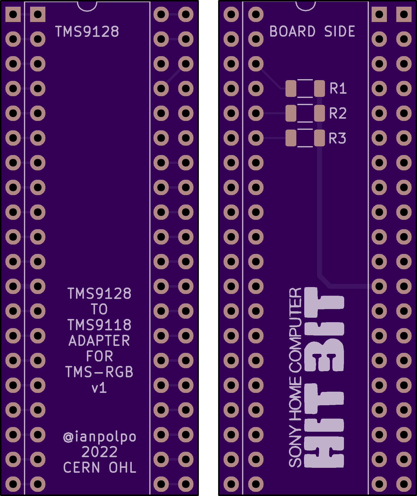
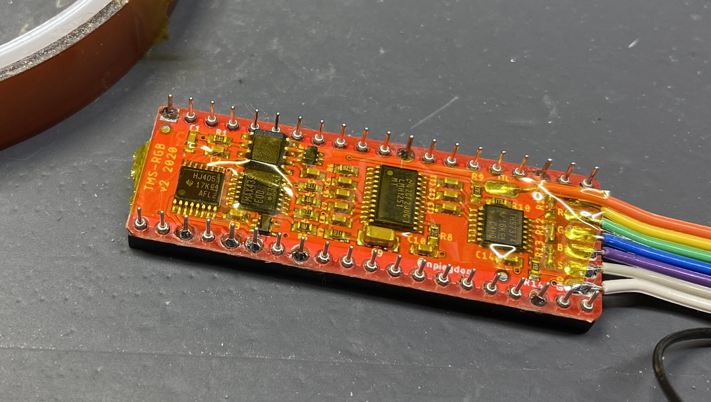

# TMS9x18 to TMS9x28 Adapter #

This is a PCB that will let you plug a TMS9128 or TMS9928 VDP, along with a [TMS-RGB](https://tms-rgb.com/), into a system that uses a TMS9118 or TMS9918 VDP. Such systems include numerous MSX computers, the NABU, and the TI 99/4A.

The adapter is intended to go in the sandwich of: TMS9x28 - socket - TMS-RGB - adapter - pin headers - socket - system motherboard.

 

There are two versions of the adapter, one for the TMS9128 and one for the TMS9928:

The TMS9128 adapter:

- Moves the TMS9128 CPUCLK signal from pin 37 to pin 38, where it is on the TMS9118.
- Adds 470 ohm load resistors on the Y, R-Y, and B-Y pins as there is no connection to the motherboard on this adapter for those pins. These resistors are required as per the TMS9128 datasheet.

The TMS9928 adapter:

- Creates a TTL clock signal from a crystal on the TMS9918 XTAL pins, divides it by 3 and outputs it on pin 38 (CPUCLK).
- Adds 470 ohm load resistors on the Y, R-Y, and B-Y pins as there is no connection to the motherboard on this adapter for those pins. These resistors are required as per the TMS9128 datasheet.

## Rationale ##

I have a Sony HB-101 "HitBit Mezzo" MSX computer that uses the relatively rare TMS9118 VDP. This is the variant that has composite output and supports 16Kx4 video RAM chips. Adding RGB output to systems using these TI VDPs is possible with the TMS-RGB project, but it requires using a VDP with component video output. For systems that use the TMS9118 VDP, a TMS9128 is a close match but the CPUCLK pin is in a different location. My HB-101 requires CPUCLK, so relocating the CPUCLK pinn is necessary. While it is possible to directly install a TMS9128 and relocate CPUCLK by cutting the clock trace on the PCB, this particular MSX is rare and valuable and I want the system to be as close to original as possible.

Later I got a NABU PC which uses the TMS9128A VDP and was tired of the composite output, so I adapted my original design to add a clock divider circuit to generate the CPUCLK output that the TMS9928 does not.

## Making the board ##

Depending on which version of the board you want, submit the gerbers under the gerbers-9918/ or gerbers-9928/ directory to your favorite PCB manufacturer. I have made mine at [OSH Park](https://oshpark.com) and [JLCPCB](https://jlcpcb.com).

For the TMS9128 version, a BOM is in the [bom-9128.csv](bom-9128.csv) file, consisting of:

- Low-profile machine pin headers, used to connect this adapter to the socket on the system motherboard
- 40-pin machine pin sockets for the TMS9128 and the system motherboard
- 3x 470 ohm 1% 1/4W 1206 SMT capacitors

TMS9x28 chips are available on the used market from eBay, AliExpress, UTSource, etc.

## Assembling the adapter ##

The assembly process is the same for both versions of the adapter. The photos in this guide are for the TMS9128 version but the TMS9928 version is assembled in the same way.

### 1. Prepare the TMS-RGB ###

The TMS-RGB will have to fit flush under the socket that the TMS9128 will plug into, meaning the holes in the TMS-RGB will have to fit over the larger diameter tops of the socket's machine pins. The plated pads that the TMS-RGB uses for its signals are large enough for this, but the un-plated holes are just a bit too small. Use a pin vise with a small diameter drill bit to enlarge the un-plated holes by hand. The PCB should cut easily so a power drill is not necessary! Be *very careful* to not drill holes large enough to come into contact with the ground plane on the TMS-RGB. The ground plane hugs these un-plated holes closely, and if the pins of the TMS9128 are shorted to ground, things will not work!

### 2. Solder the TMS-RGB to the socket ###

Place the TMS-RGB on the socket, ensuring it is flush and that pin 1 of the TMS-RGB, denoted by the square pad, is on the same end as the key notch of the socket. Solder the signal pads of the TMS-RGB to the pins of the socket.

### 3. Wire up the TMS-RGB and insulate ###

Connect the output wires of the TMS-RGB according to the [connection diagram for your choice of output cable in the TMS-RGB installation guide](https://tms-rgb.com/guideOutput.html). Insulate the top of the TMS-RGB with Kapton tape or some other thin insulator, as the top will be coming into close contact with the pin headers on the adapter.

### 4. Assemble the adapter ###

Solder all surface mount components to the adapter if you did not order it preassembled, then solder the machine pin headers. Then use a flush cutter to cut the tops of the protruding pins from the headers *as close as possible* to the top of the adapter PCB, being careful to not damage any traces. The tallest chip on the TMS-RGB, the LM1881, will be right up against these headers. and a large SMD capacitor will also be quite close, so it is important to make these as flush as possible.

### 5. Connect the adapter to the TMS-RGB + socket ###

Align the adapter to the TMS-RGB, being sure that the notch on the TMS-RGB's socket matches with the notch in the silkscreen on the adapter. This part is tricky – the pins of the socket should *just* be long enough to go through the holes in the adapter and be soldered. Keeping things level will be fiddly. I recommend tacking opposite corners while holding the assembly in your hands or in a small vise.

### 6. You're done! ###

Insert the TMS9x28 into the assembly, then place the assembly into the system's motherboard where the VDP should go. I recommend using a machine pin socket, but if height is an issue, you can solder directly into the motherboard.

## License ##

[The project license](LICENSE.txt) is under the CERN Open Hardware Licence Version 2 - Permissive.
